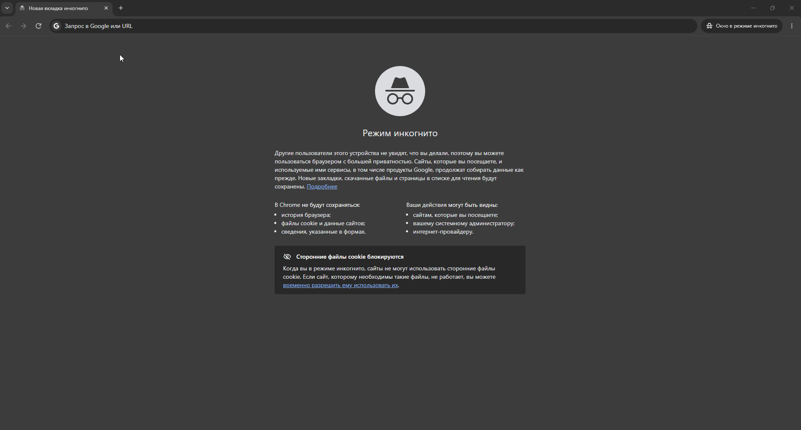

# TaskBoard

Канбан-доска для управления задачами (в духе Trello): доски → списки → карточки,
с авторизацией, ролями участников, метками и комментариями.

Проект основан на идее ["Create a Trello Clone"](http://codeloveandboards.com/blog/2016/01/04/trello-tribute-with-phoenix-and-react-pt-1/)
из каталога [project-based-learning](https://github.com/practical-tutorials/project-based-learning),
реализован самостоятельно на стеке Node.js/Express + PostgreSQL + React.

   [](https://qlty.sh/gh/pisohndidi/projects/taskboard)

   

## Возможности

- Регистрация и вход (JWT), пароли хранятся как bcrypt-хэши
- Создание досок, приглашение участников по email (роли owner/member)
- Списки (колонки) и карточки внутри них, перемещение карточек между списками
- Метки (labels) с цветами, привязка к карточкам
- Комментарии к карточкам
- Разграничение доступа: видеть и менять доску может только её участник

## Стек

- **Frontend:** React 18, React Router, Vite, axios
- **Backend:** Node.js, Express, JWT (jsonwebtoken), bcryptjs
- **DB:** PostgreSQL (pg), SQL-схема с миграцией и сид-скриптом
- **Тесты:** Jest + Supertest (backend)

## Структура репозитория

```
taskboard/
├── backend/          # REST API
│   ├── src/
│   │   ├── db/        # schema.sql, pool.js, migrate.js, seed.js
│   │   ├── middleware/ # auth.js, boardAccess.js
│   │   ├── routes/     # auth.js, boards.js, lists.js, cards.js
│   │   ├── app.js
│   │   └── server.js
│   └── tests/
├── frontend/         # SPA на React
│   └── src/
│       ├── pages/      # Login, Register, Boards, BoardDetail
│       ├── components/ # CardModal, ProtectedRoute
│       └── context/     # AuthContext
└── render.yaml       # деплой одной кнопкой на Render
```

## Как запустить локально

Понадобится Node.js 20+ и PostgreSQL 14+.

```bash
# 1. Создать БД
createdb taskboard

# 2. Backend
cd backend
cp .env.example .env      # проверьте DATABASE_URL
npm install
npm run migrate           # создаёт таблицы
npm run seed               # тестовый пользователь + демо-доска
npm run dev                 # http://localhost:4000

# 3. Frontend (в новом терминале)
cd frontend
cp .env.example .env
npm install
npm run dev                 # http://localhost:5173
```

Тестовые данные (создаются командой `npm run seed`):

- **email:** `demo@taskboard.dev`
- **пароль:** `demo12345`

## Тесты

```bash
cd backend
npm test
```

## Деплой

Ссылка на рабочую версию: https://taskboard-frontend-n3gs.onrender.com
Инструкция по деплою на Render — в `DEPLOY.md`.

## API

Основные эндпойнты (полный список — в коде роутов):

| Метод | Путь | Описание |
|---|---|---|
| POST | `/api/auth/register` | Регистрация |
| POST | `/api/auth/login` | Вход |
| GET | `/api/boards` | Список моих досок |
| POST | `/api/boards` | Создать доску |
| GET | `/api/boards/:id` | Доска целиком (списки, карточки, метки, участники) |
| POST | `/api/boards/:id/members` | Пригласить участника |
| POST | `/api/boards/:id/lists` | Новый список |
| POST | `/api/lists/:id/cards` | Новая карточка |
| PATCH | `/api/cards/:id` | Изменить/переместить карточку |
| POST | `/api/cards/:id/comments` | Добавить комментарий |
| POST | `/api/cards/:id/labels` | Прикрепить метку |

## Лицензия

MIT
